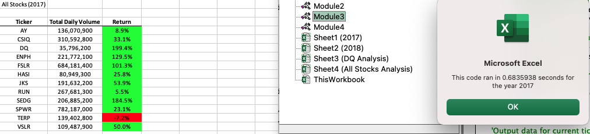

# VBA Stock analysis
- Perform data analysis of Steve's stock data using Excel formulas for calculations.

## Overview of the project:
- The project wants to expand the dataset to include the entire stock market over the last few years. It will help to calculate the stock price change for the year, the price percent change for the year, and the total volume traded for that year. It will then sort through the calculated data. 

## Purpose
- In this project we will edit, refactor the entire dataset with VBA code to loop through all the data at one time inorder to to get the entire stock market for the last few years.  

## Analysis based on code
Few Analysis of this Project were:
- Prepare our dataset VBA_Challenge.vbs file for the project.
- Create and convert our XLSM file from *.vbs dataset that you used in this module as VBA_Challenge.xlsm.
- Create our resources folder in GitHub to hold .png images of the run-time pop-up messages and screenshot after running refactored analyses for 2017 and 2018.

## Code Examples
 
- From the given dataset a comparison was made between year 2017 and 2018. Results shows that positive returns green and negative returns red, to determine which stocks perfomed good or bad for 2017 and 2018 data.
   
- Added some formatting based on the values of the returns.

- Adding Comments makes code more readable and helps to determine positive result as green and negative as red.
 
- The code from 2018 ran faster than 2017 while both data sheets had the same number of tickers and same rows to pick calculations from (3013).

## Results based on AllStocksAnalysis & Refactored for Year 2017  

## Results based on AllStocksAnalysis & Refactored for Year 2018

## ADVANTAGES OR DISADVANTAGES OF Refactoring Code
Refactoring is a key part of the coding process. When refactoring code, we aren’t adding new functionality; but rather making the code more efficient by taking fewer steps, using less memory, or improving the logic of the code to make it easier for future users to read. Refactoring is common usually the first attempt at code won’t always be the best way to accomplish a task. 
### Advantages of Refactoring
- Refactoring makes code for efficient by taking fewer steps.
- Refactoring uses less memory.
- Refactoring Helps finding bugs.
- Refactoring helps programming faster.
### Disadvantages of Refactoring
- It is risky when the application is too big.
- It is risky when code does not have proper test cases.
- It is not advisable when it exceeds budget and time.
- It is risky when developers are not sure what needs to be refactored.

## Pros and Cons apply to refactoring the Original VBA Script
- Improving or updating the code without changing the software’s functionality or external behavior of the application is known as code refactoring.

- Let's take a different thinking if after few days or couple months we need to troubleshoot our code? will that be too complicated? will it be understandable? 
  - If the answer is yes, then we definetely did not pay attention on improving the code or to refactor it during the initial development. 

- we need to consider about code refactoring in that case as unneccessary clutterness makes code inefficient. 

- A clean and well-organized code with proper formatting is always easy to change, understand and maintain. It is always advisable to refactor during the initial development cycle to avoid difficulties later.